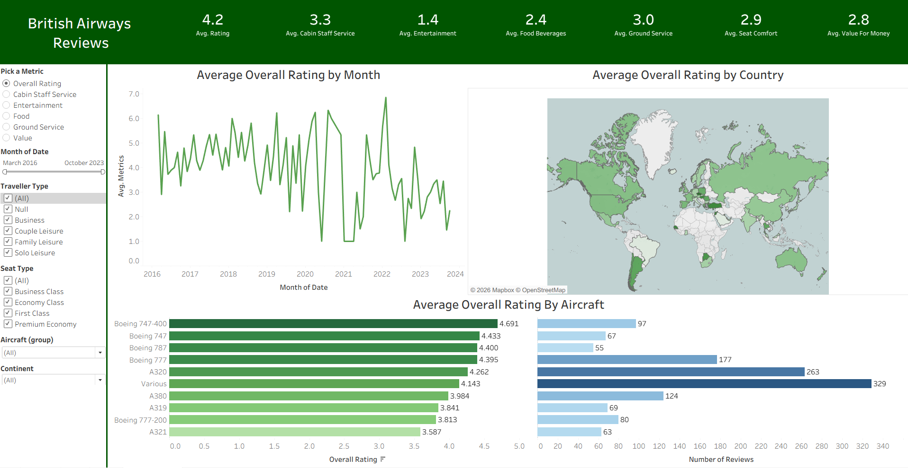

# British-Airways-Reviews-Tableau-Dashboard

## Description
This project is an interactive Tableau dashboard that analyzes customer reviews of British Airways. It provides insights into overall ratings, service quality, aircraft performance, and geographic trends to help understand customer satisfaction and identify areas for improvement.

## Dashboard Screenshot

## Tools Used
- Tableau
- Data Cleaning
- Calculated Fields
- Parameters
- Interactive Filters
- Map Visualizations

## Objectives
- Analyze customer ratings across different service categories
- Track changes in overall ratings over time
- Compare ratings across countries and continents
- Evaluate aircraft performance based on customer reviews
- Enable interactive exploration using filters and metric selection

## Business Questions Addressed
1. What is the average overall rating of British Airways?
2. How do ratings for cabin staff service, entertainment, food, seat comfort, and value for money compare?
3. How has the overall rating changed over time?
4. Which countries provide the highest and lowest ratings?
5. Which aircraft types receive the best customer ratings?
6. How many reviews are available for each aircraft?
7. How do ratings vary by traveller type and seat class?

## Key Insights
- British Airways received an average overall rating of 4.2 out of 5.
- Cabin staff service scored 3.3, while entertainment received the lowest average score of 1.4.
- Food and beverages scored 2.4, seat comfort scored 2.9, and value for money scored 2.8.
- Overall ratings have declined in recent years, indicating a drop in customer satisfaction.
- The Boeing 747-400 received the highest average aircraft rating among the most reviewed aircraft.
- Ratings vary significantly across countries and traveller segments.

## Conclusion and Recommendations
The analysis indicates that British Airways faces challenges in customer satisfaction, particularly in entertainment, food quality, and value for money. To improve customer experience, the airline should focus on upgrading onboard entertainment, enhancing meal quality, and increasing perceived value. Monitoring ratings by traveller type, seat class, and aircraft can help prioritize service improvements.

## Files Included
- British_Airways_Reviews.twbx
- Dashboard.png

## Download Tableau Workbook
[Download the Tableau Workbook](British_Airways_Reviews.twbx)

